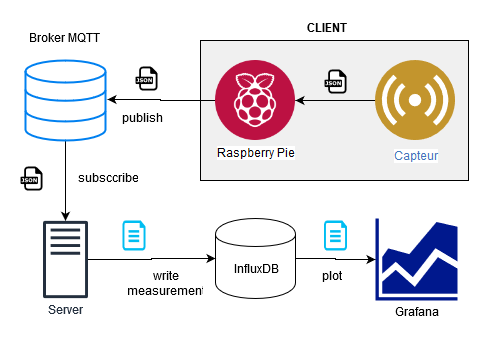
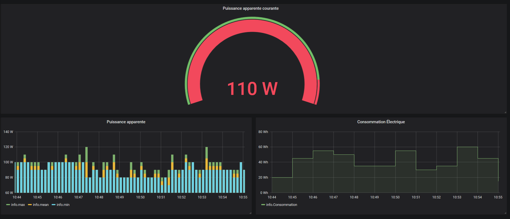

# Mise en oeuvre d'une infrastructure de communication, stockage et portail WEB pour la télé-relève de consommation électrique.
Dylan DERVAUX - Gaétan ROGER
## Présentation de votre travail
Dans un soucis d'optimisation continuelle, l'objectif de ce tp était de mettre en place un système de reporting en temps réél des consommations éléctrique.

De ce fait, nous avons mis en place une pile logicielle permettant une communication directe entre un client rapsberry pi et un serveur via un broker MQTT.

Par manque de matériel informatique, nous avons utilisé nos ordinateurs portable en lieu et place des serveurs et raspberry pi.

## Justification des choix techniques retenus
### Mosquitto
Eclipse Mosquitto est un broker open source (licence EPL/EDL) qui implémente les versions 5.0, 3.1.1 et 3.1 du protocole MQTT. Mosquitto est léger et peut être utilisé sur tous les appareils, de l'ordinateur monocarte de faible puissance aux serveurs complets. Le protocole MQTT fournit une méthode légère d'exécution du broker à l'aide d'un modèle de publication/abonnement. Cela le rend adapté à l'Internet des objets tels que les capteurs de faible puissance ou les appareils mobiles tels que les téléphones, les ordinateurs embarqués ou les microcontrôleurs.

Le projet Mosquitto fournit également une bibliothèque C pour l'implémentation des clients MQTT, et les très populaires clients mosquitto_pub et mosquitto_sub en ligne de commande MQTT. De plus, de nombreuses implémentations dans de nombreux langages existent déjà, ce qui facilitera et standardisera nos développements.


### Java
Java est un langage de programmation polyvalent qui est basé sur des classes, orienté objet et conçu pour avoir le moins de dépendances d'implémentation possible. Il est destiné à permettre aux développeurs d'applications d'écrire une seule fois, de s'exécuter n'importe où (WORA), ce qui signifie que le code Java compilé peut fonctionner sur toutes les plates-formes qui supportent Java sans avoir besoin de recompilation.

Pour le broker MQTT, nous avons utilisé le client java Eclipse Paho. Le Client Java Paho est une bibliothèque client MQTT écrite en Java pour le développement d'applications qui s'exécutent sur la JVM ou d'autres plates-formes compatibles Java comme Android.

Le client Java Paho fournit deux API : MqttAsyncClient fournit une API entièrement asychrone où la fin des activités est notifiée via des rappels enregistrés. MqttClient est un wrapper synchrone autour de MqttAsyncClient où les fonctions apparaissent synchrones à l'application.


### InfluxDB
InfluxDB est une base de données de séries chronologiques open-source développée par InfluxData. Elle est écrite en Go et optimisée pour un stockage et une récupération rapides et à haute disponibilité des données de séries temporelles dans des domaines tels que la surveillance des opérations, les métriques applicatives, les données des capteurs de l'internet des objets et les analyses en temps réel.


### Grafana
Grafana permet d'interroger, de visualiser, d'alerter et de comprendre les métriques quel que soit l'endroit où elles sont stockées et de créer, explorer et partager des tableaux de bord. Grafana a l'avantage de bien s'intégrer avec InfluxDB.


### Docker

Docker est un ensemble de produits de Plateform as a Service (PaaS) qui utilisent la virtualisation au niveau du système d'exploitation pour fournir des logiciels dans des packages appelés conteneurs. Les conteneurs sont isolés les uns des autres et regroupent leurs propres logiciels, bibliothèques et fichiers de configuration ; ils peuvent communiquer entre eux par des canaux bien définis. Tous les conteneurs sont gérés par un seul noyau de système d'exploitation et sont donc plus légers que les machines virtuelles. 


## Mise en oeuvre des technologies retenues

### Schéma général

Afin d'exporter et de grapher les données dans Grafana, nous avons connecté les technologies de la manière suivante :



### Raspberry Pie
Par simplification, le rôle de la Raspberry Pie a été joué dans ce TP par un programme Java. Celui-ci s'occupe d'interroger le capteur via son API JSON afin d'y récupérer les mesures. Une mesure a le format suivant :

```json
{                          
    "product": "Eco-devices",  
    "T1_PTEC": "TH..",         
    "T1_PAPP": 130,            
    "T1_BASE": 1875395,        
    "T2_PTEC": "----",         
    "T2_PAPP": 0,              
    "T2_BASE": 0,              
    "INDEX_C1": 784482,        
    "INDEX_C2": 10818          
}                          
```

Une fois ces données récupérées, il va les publier dans le broker MQTT via la library Java Paho :

```java
// Connection au broker MQTT
MqttClient client = new MqttClient("tcp://localhost:8123", MqttClient.generateClientId());
client.connect();

// Création du message
MqttMessage message = new MqttMessage();
message.setPayload(messageStr.getBytes());

// Publication du message
client.publish("MQTTNQNTMQMQMB", message);

// Déconnexion
client.disconnect();
```

Afin de mettre à jour les données, le Raspberry Pie va répéter ces étapes régulièrement.

### Serveur

Le serveur s'occupe de récupérer les informations dans le broker MQTT et d'insérer les données dans la base de données InfluxDB

#### Récupération des données

La récupération des données se fait via le client Java Paho. En créant une classe implémentant l'interface MqttCallback, nous avons la possibilité de controler les actions à effectué lors de la récéption des données :

```java
// Constructeur de la classe initialisant le client MQTT
public CallbackMqtt(InfluxDB influxDB) {
    super();
    this.influxDB = influxDB;
    try {
        mqttClient = new MqttClient("tcp://192.168.20.110:8123", MqttClient.generateClientId());
        mqttClient.setCallback(this);
        mqttClient.connect();
        mqttClient.subscribe("MQTTNQNTMQMQMB");
        mqttClient.setTimeToWait(10000);
    } catch (MqttException e) {
        e.printStackTrace();
    }
}

public void messageArrived(String s, MqttMessage mqttMessage) {
  // Insertion des données dans influxDB (voir ci-dessous)
}

```

#### Insertion des données dans le SGBD InfluxDB

À chaque messages reçu par le client MQTT, nous exécutons une insertion de données dans notre base de données InfluxDB.

La connexion à InfluxDB se fait via la librairie `influxdb-java`.

```java
// Connexion à la base de données
InfluxDB influxDB = InfluxDBFactory.connect("http://localhost:8086", "user", "password");
Pong response = influxDB.ping();
if (response.getVersion().equalsIgnoreCase("unknown")) {
    System.out.println("Error pinging server.");
    return;
}
final String dbName = "data";
influxDB.query(new Query("CREATE DATABASE " + dbName));
influxDB.setDatabase(dbName);

// Insertion des données dans la base de données
Point currentPoint = Point.measurement("info")
        .time(System.currentTimeMillis(), TimeUnit.MILLISECONDS)
        .addField("product", result.getProduct())
        .addField("T1_PTEC", result.getT1_PTEC())
        .addField("T1_PAPP", result.getT1_PAPP())
        .addField("T1_BASE", result.getT1_BASE())
        .addField("T2_PTEC", result.getT2_PTEC())
        .addField("T2_PAPP", result.getT2_PAPP())
        .addField("T2_BASE", result.getT2_BASE())
        .addField("INDEX_C1", result.getINDEX_C1())
        .addField("INDEX_C2", result.getINDEX_C2())
        .build();
try {
    influxDB.write(currentPoint);
} catch (Exception e) {
    e.printStackTrace();
}


```

### Grafana et influxDB

Afin de mettre en place Grafana et InfluxDB, nous avons utilisé des images docker via la technologie `docker-compose`. Docker-compose nous permet de créér des piles de conteneurs Docker afin de faciliter la communication. De ce fait, après avoir provisionné la base de données des informations de notre compteur éléctrique, nous les avons affiché sur notre tableau de bord Gafana.

Le fichier docker-compose utilisé est le suivant :

```yml

version: '2'
services:
  influxdb:
    image: influxdb:latest
    ports:
      - '8086:8086'
    environment:
      - INFLUXDB_DB=data
      - INFLUXDB_ADMIN_USER=user
      - INFLUXDB_ADMIN_PASSWORD=password
  grafana:
    image: grafana/grafana:latest
    ports:
      - '3000:3000'
    depends_on:
      - influxdb
    environment:
      - GF_SECURITY_ADMIN_USER=user
      - GF_SECURITY_ADMIN_PASSWORD=password

```

Dans notre environnement de test, les identifiants utilisés pour InfluxDB et Grafana sont user/password.

## Plan de test
Afin de tester le fonctionnement de l'architecture, on va mocker les données reçues du capteur pour y mettre des données de test au niveau de la Raspberry Pie. On va ensuite vérifier qu'elles sont bien enregistrées dans la base de données InfluxDB. Ci-après un exemple de données mockées :

```json
{
    "product": "ProduitDeTest",
    "T1_PTEC": "TH..",
    "T1_PAPP": 130,
    "T1_BASE": 1234567,
    "T2_PTEC": "----",
    "T2_PAPP": 0,
    "T2_BASE": 0,
    "INDEX_C1": 812345,
    "INDEX_C2": 12345
}
```

Après exécution du programme, on trouve bien les données dans la base InfluxDB.


## Vérification que tout fonctionne




## Perspectives d'évolution du projet
Plusieurs améliorations sont envisageables :
 * Chiffrage des données transmises afin d'assurer la confidentialité des données
 * Système d'alerte si les données du capteur sont trop extrêmes (conommation élevée)
 * Système d'alerte si aucune donnée ne peut être récupérée sur le capteur après plusieurs tentatives

## Ce que vous avez personnellement apporté au binôme ….
### Gaétan Roger
Dans cet atelier, je me suis occupé de la partie client ainsi que du broker :
* Setup du broker MQTT
* Récupération des données du capteur via son API JSON
* Publication des données dans le broker avec la librairie Java Paho
* Configuration de cette tâche pour l'exécuter à intervale régulier (TimerTask Java)

### Dylan Dervaux
De mon coté, j'ai développé les taches se rapportant au serveur.

Dans un premier temps j'ai développé la partie Java :
- Connexion au broker MQTT
- Récupération des données sur le broker avec la librairie Java Paho
- Connexion à la base de données InfluxDB avec la librairie influx-java
- Insertion des données dans la base de données

Puis j'ai connecté les conteneurs docker entre eux :
- Création du fichier docker-compose
- Interconnexion entre InfluxDB et Grafana

### En binome
En binome nous avons 
- Débug du programme Java coté serveur
- Mise en place des tests de mocking
- Création des tableaux de bords Grafana
- Rédaction du rapport